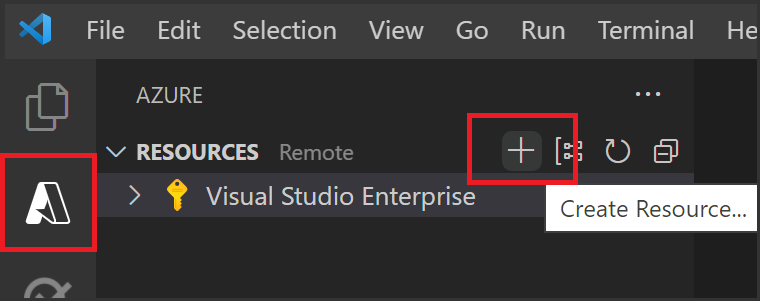
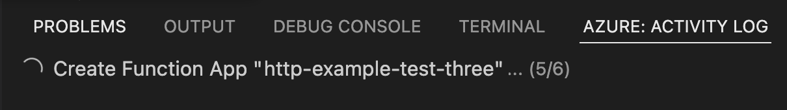

# WHAT WE'LL COVER TODAY

* Create your local Azure Java Function project
* Run the function locally
* Create, deploy and run the function app in Azure
* **Resource(s):** [Develop Java serverless Functions on Azure using Maven](https://docs.microsoft.com/learn/modules/develop-azure-functions-app-with-maven-plugin/)

## Prerequisites 🛠️

1. **An Azure account with an active subscription** - [Create an account for free](https://azure.microsoft.com/free/?ref=microsoft.com&utm_source=microsoft.com&utm_medium=docs&utm_campaign=visualstudio)

2. **The Java Development Kit, version 11 or 8.** - [Install](https://docs.microsoft.com/azure/developer/java/fundamentals/java-support-on-azure)

3. **Apache Maven, version 3.0 or above.** - [Install](https://maven.apache.org/)

4. **Visual Studio Code.** - [Install](https://code.visualstudio.com/)

5. **The Java extension pack** - [Install](https://marketplace.visualstudio.com/items?itemName=vscjava.vscode-java-pack)

6. **The Azure Functions extension for Visual Studio Code** - [Install](https://marketplace.visualstudio.com/items?itemName=ms-azuretools.vscode-azurefunctions)

## 1. Create your local project

In this section, you use Visual Studio Code to create a local Azure Functions project in Java. Later in this article, you'll publish your function code to Azure.

In this section, you use Visual Studio Code to create a local Azure Functions project in Java. Later in this article, you'll publish your function code to Azure.

1. Choose the Azure icon in the Activity bar. Then in the **Workspace (local)** area, select the **+** button, choose **Create Function** in the dropdown. When prompted, choose **Create new project**.

    :::image type="content" source="../static/img/series/java/32-create-new-project.png" alt-text="Screenshot of create a new project window.":::

1. Choose the directory location for your project workspace and choose **Select**. You should either create a new folder or choose an empty folder for the project workspace. Don't choose a project folder that is already part of a workspace.

1. Provide the following information at the prompts:

    |Prompt|Selection|
    |--|--|
    |**Select a language**| Choose `Java`.|
    |**Select a version of Java**| Choose `Java 11` or `Java 8`, the Java version on which your functions run in Azure. Choose a Java version that you've verified locally. |
    | **Provide a group ID** | Choose `com.function`. |
    | **Provide an artifact ID** | Choose `myFunction`. |
    | **Provide a version** | Choose `1.0-SNAPSHOT`. |
    | **Provide a package name** | Choose `com.function`. |
    | **Provide an app name** | Choose `myFunction-12345`. |
    |**Select a template for your project's first function**| Choose `HTTP trigger`.|
    | **Select the build tool for Java project** | Choose `Maven`. |
    |**Provide a function name**| Enter `HttpExample`.|
    |**Authorization level**| Choose `Anonymous`, which lets anyone call your function endpoint.|
    |**Select how you would like to open your project**| Choose `Add to workspace`.|

1. Visual Studio Code uses the provided information and generates an Azure Functions project with an HTTP trigger. You can view the local project files in the Explorer.

## 2. Run the function locally

Visual Studio Code integrates with the Azure Functions Core tools to let you run this project on your local development computer before you publish to Azure.

1. To start the function locally, press <kbd>F5</kbd> or the play icon. The **Terminal** panel displays the Output from Core Tools. Your app starts in the **Terminal** panel. You can see the URL endpoint of your HTTP-triggered function running locally.

    :::image type="content" source="../static/img/series/java/32-functions-vscode-f5.png" alt-text="Screenshot of the Local function VS Code output.":::

    If you have trouble running on Windows, make sure that the default terminal for Visual Studio Code isn't set to **WSL Bash**.

1. With Core Tools still running in **Terminal**, choose the Azure icon in the activity bar. In the **Workspace** area, expand **Local Project** > **Functions**. Right-click (Windows) or <kbd>Ctrl -</kbd> click (macOS) the `HttpExample` function and choose **Execute Function Now...**.

    

1. In **Enter request body** you see the request message body value of `{ "name": "Azure" }`. Press Enter to send this request message to your function.

1. When the function executes locally and returns a response, a notification is raised in Visual Studio Code. Information about the function execution is shown in **Terminal** panel.

1. With the **Terminal** panel focused, press <kbd>Ctrl + C</kbd> to stop Core Tools and disconnect the debugger.

After you've verified that the function runs correctly on your local computer, it's time to use Visual Studio Code to publish the project directly to Azure.

## 3. Sign in to Azure

Before you can publish your app, you must sign in to Azure.

1. If you aren't already signed in, choose the Azure icon in the Activity bar. Then in the **Resources** area, choose **Sign in to Azure...**.

    :::image type="content" source="../static/img/series/java/32-functions-sign-into-azure.png" alt-text="Screenshot of the sign-in to Azure window within VS Code.":::

    If you're already signed in and can see your existing subscriptions, go to the next section. If you don't yet have an Azure account, choose **Create and Azure Account...**. Students can choose **Create and Azure for Students Account...**.

2. When prompted in the browser, choose your Azure account and sign in using your Azure account credentials. If you create a new account, you can sign in after your account is created.

3. After you've successfully signed in, you can close the new browser window. The subscriptions that belong to your Azure account are displayed in the sidebar.

In this section, you create a function app and related resources in your Azure subscription.

1. Choose the Azure icon in the Activity bar. Then in the **Resources** area, select the **+** icon and choose the **Create Function App in Azure** option.

    

1. Provide the following information at the prompts:

    |Prompt|Selection|
    |--|--|
    |**Select subscription**| Choose the subscription to use. You won't see this prompt when you have only one subscription visible under **Resources**. |
    |**Enter a globally unique name for the function app**| Type a name that is valid in a URL path. The name you type is validated to make sure that it's unique in Azure Functions.|
    |**Select a runtime stack**| Choose the language version on which you've been running locally. |
    |**Select a location for new resources**| For better performance, choose a region near you.|

    The extension shows the status of individual resources as they're being created in Azure in the **Azure: Activity Log** panel.

    

1. When the creation is complete, the following Azure resources are created in your subscription. The resources are named based on your function app name:

* A resource group, which is a logical container for related resources.
* A standard Azure Storage account, which maintains state and other information about your projects.
* A function app, which provides the environment for executing your function code. A function app lets you group functions as a logical unit for easier management, deployment, and sharing of resources within the same hosting plan.
* An App Service plan, which defines the underlying host for your function app.
* An Application Insights instance connected to the function app, which tracks usage of your functions in the app.

    A notification is displayed after your function app is created and the deployment package is applied.

    > [!TIP]
    > By default, the Azure resources required by your function app are created based on the function app name you provide. By default, they're also created in the same new resource group with the function app. If you want to either customize the names of these resources or reuse existing resources, you need to publish the project with advanced create options instead.

## 4. Run the function in Azure

1. Back in the **Resources** area in the side bar, expand your subscription, your new function app, and **Functions**. Right-click (Windows) or <kbd>Ctrl -</kbd> click (macOS) the `HttpExample` function and choose **Execute Function Now...**.

    :::image type="content" source="../static/img/series/java/32-execute-function-now.png" alt-text="Screenshot of executing function in Azure from Visual Studio Code.":::

2. In **Enter request body** you see the request message body value of `{ "name": "Azure" }`. Press Enter to send this request message to your function.

3. When the function executes in Azure and returns a response, a notification is raised in Visual Studio Code.

## 5. Clean up resources

You can use the following steps to delete the function app and its related resources to avoid incurring any further costs.

In Visual Studio Code, press F1 to open the command palette. In the command palette, search for and select Azure: Open in portal.

Choose your function app and press Enter. The function app page opens in the Azure portal.

In the Overview tab, select the named link next to Resource group.

:::image type="content" source="../static/img/series/java/32-functions-app-delete-resource-group.png" alt-text="Screenshot of select the resource group to delete from the function app page.":::

On the Resource group page, review the list of included resources, and verify that they're the ones you want to delete.

In the Resource group page, review the list of included resources, and verify that they are the ones you want to delete.

Select Delete resource group, and follow the instructions.

Deletion may take a couple of minutes. When it's done, a notification appears for a few seconds. You can also select the bell icon at the top of the page to view the notification.
