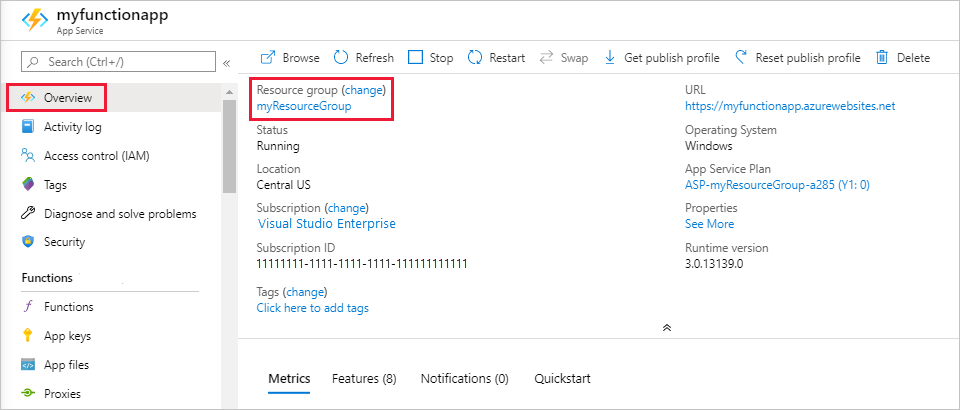

# WHAT WE'LL COVER TODAY

* Create your local Azure Java Function project
* Run the function locally
* Create, deploy and run the function app in Azure
* **Resource(s):** [Develop Java serverless Functions on Azure using Maven](https://docs.microsoft.com/learn/modules/develop-azure-functions-app-with-maven-plugin/)

## Prerequisites 🛠️

1. **An Azure account with an active subscription** - [Create an account for free](https://azure.microsoft.com/free/?ref=microsoft.com&utm_source=microsoft.com&utm_medium=docs&utm_campaign=visualstudio)

2. **The Java Development Kit, version 11 or 8.** - [Install](https://docs.microsoft.com/azure/developer/java/fundamentals/java-support-on-azure)

3. **Apache Maven, version 3.0 or above.** - [Install](https://maven.apache.org/)

4. **Visual Studio Code.** - [Install](https://code.visualstudio.com/)

5. **The Java extension pack** - [Install](https://marketplace.visualstudio.com/items?itemName=vscjava.vscode-java-pack)

6. **The Azure Functions extension for Visual Studio Code** - [Install](https://marketplace.visualstudio.com/items?itemName=ms-azuretools.vscode-azurefunctions)

## 1. Create your local project

In this section, you use Visual Studio Code to create a local Azure Functions project in Java. Later in this article, you'll publish your function code to Azure.

In this section, you use Visual Studio Code to create a local Azure Functions project in Java. Later in this article, you'll publish your function code to Azure.

# 2. Create local Azure Function app in Visual Studio Code with Maven

In this article of the series, you create an Azure Function app in Visual Studio Code to manage Azure resource groups.

## Create function app

Use Visual Studio Code to create a local Function app.

1. In a bash terminal, create and change into a new directory:

    ```bash
    mkdir java-function-resource-group-api && cd java-function-resource-group-api
    ```

1. In a bash terminal, open Visual Studio Code:

    ```bash
    code .
    ```

1. Open the Visual Studio Code command palette: <kbd>Ctrl</kbd> + <kbd>Shift</kbd> + <kbd>p</kbd>.

1. Enter `Azure Functions: create new project`. Use the following table to finish the prompts:

    |Prompt|Value|
    |--|--|
    |**Choose the directory location.**|You should either create a new folder or choose an empty folder for the project workspace. Don't choose a project folder that is already part of a workspace.|
    |**Select a language**| Choose `Java`.|
    |**Select a version of Java**| Choose `Java 11` or `Java 8`, the Java version on which your functions run in Azure. Choose a Java version that you've verified locally. |
    | **Provide a group ID** | Choose `com.function`. |
    | **Provide an artifact ID** | Choose `myFunction`. |
    | **Provide a version** | Choose `1.0-SNAPSHOT`. |
    | **Provide a package name** | Choose `com.function`. |
    | **Provide an app name** | Choose `HttpExample`. |
    | **Select the build tool for Java project** | Choose `Maven`. |
    The project boilerplate is created.

1. Visual Studio Code uses the provided information and generates an Azure Functions project. You can view the local project files in the Explorer.

## 2. Run the function locally

Visual Studio Code integrates with the Azure Functions Core tools to let you run this project on your local development computer before you publish to Azure.

To build your application, you would use the following Maven command:

```bash
mvn clean package
```

To run the application, you would use the following Maven command:

```bash
mvn azure-functions:run
```

Toward the end of the output, the following lines should appear:

 ```bash
 Now listening on: http://0.0.0.0:7071
 Application started. Press Ctrl+C to shut down.

 Http Functions:

         HttpExample: [GET,POST] http://localhost:7071/api/HttpExample
 ...
```

1. Copy the URL of your HttpExample function from this output to a browser and append the query string ?name=<YOUR_NAME>, making the full URL like http://localhost:7071/api/HttpExample?name=Functions. The browser should display a message that echoes back your query string value. The terminal in which you started your project also shows log output as you make requests.

1. With the **Terminal** panel focused, press <kbd>Ctrl + C</kbd> to stop Core Tools and disconnect the debugger.

After you've verified that the function runs correctly on your local computer, it's time to use Visual Studio Code to publish the project directly to Azure.

## 3. Sign in to Azure

Before you can deploy, sign in to your Azure subscription using either Azure CLI or Azure PowerShell.

```bash
az login
```

The az login command signs you into your Azure account.

Use the following command to deploy your project to a new function app.

```bash
mvn azure-functions:deploy
```

1. When the creation is complete, the following Azure resources are created in your subscription. The resources are named based on your function app name:

* Resource group. Named as java-functions-group.
* Storage account. Required by Functions. The name is generated randomly based on Storage account name requirements.
* Hosting plan. Serverless hosting for your function app in the westus region. The name is java-functions-app-service-plan.
* Function app. A function app is the deployment and execution unit for your functions. The name is randomly generated based on your artifactId, appended with a randomly generated number.

## 4. Run the function in Azure

1. Back in the **Resources** area in the side bar, expand your subscription, your new function app, and **Functions**. Right-click (Windows) or <kbd>Ctrl -</kbd> click (macOS) the `HttpExample` function and choose **Execute Function Now...**.

    

2. In **Enter request body** you see the request message body value of `{ "name": "Azure" }`. Press Enter to send this request message to your function.

3. When the function executes in Azure and returns a response, a notification is raised in Visual Studio Code.

## 5. Clean up resources

You can use the following steps to delete the function app and its related resources to avoid incurring any further costs.

In Visual Studio Code, press F1 to open the command palette. In the command palette, search for and select Azure: Open in portal.

Choose your function app and press Enter. The function app page opens in the Azure portal.

In the Overview tab, select the named link next to Resource group.



On the Resource group page, review the list of included resources, and verify that they're the ones you want to delete.

In the Resource group page, review the list of included resources, and verify that they are the ones you want to delete.

Select Delete resource group, and follow the instructions.

Deletion may take a couple of minutes. When it's done, a notification appears for a few seconds. You can also select the bell icon at the top of the page to view the notification.
